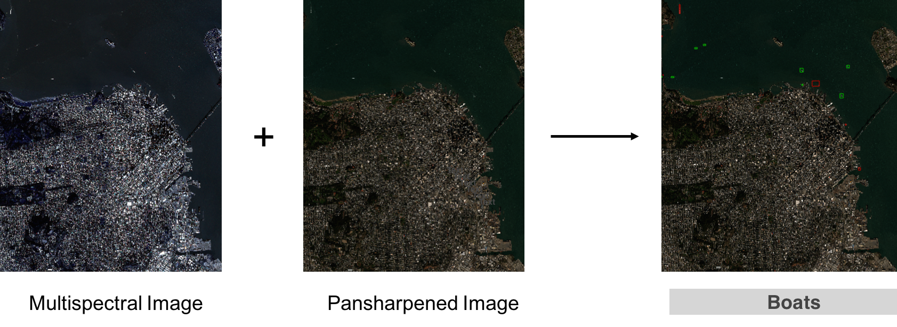

# boat-detector

A GBDX task that detects boats at sea or at the dock. Boats include ships, vessels, speed boats, barges and cranes (self- propelled or not).

The inputs to the task are a 4/8-band multispectral image, its pan-sharpened counterpart and, optionally, a water mask. The output is a geojson file with the detection bounding boxes.




## Run

This is a sample workflow to detect boats in the New York area. The required input imagery is found in S3.

1. Within an iPython terminal create a GBDX interface an specify the task input location:  

    ```python
    from gbdxtools import Interface
    from os.path import join
    import uuid

    gbdx = Interface()

    input_location = 's3://gbd-customer-data/32cbab7a-4307-40c8-bb31-e2de32f940c2/platform-stories/boat-detector/'
    ```

2. Create a task instance and set the required [inputs](#inputs):  

    ```python
    bd = gbdx.Task('boat-detector-dev')
    bd.inputs.ps_image = join(input_location, 'ps_image')
    bd.inputs.ms_image = join(input_location, 'ms_image')
    bd.inputs.mask = join(input_location, 'mask')
    ```

3. Create a workflow instance and specify where to save the output:  

    ```python
    wf = gbdx.Workflow([bd])
    random_str = str(uuid.uuid4())
    output_location = join('platform-stories/trial-runs', random_str)

    wf.savedata(bd.outputs.results, join(output_location, 'boat_detections'))
    ```

5. Execute the workflow:  

    ```python
    wf.execute()
    ```

6. Track the status of the workflow as follows:

    ```python
    wf.status
    ```

## Algorithm

The task does the following:

+ If a water mask is not provided, it computes one from the multispectral image using the normalized difference water index.
+ Computes a dissimilarity map between adjacent pixels of the multispectral image in order to highlight material differences.
+ Masks the dissimilarity map with the water mask then detects elongated features in the masked dissimilarity map using max-tree filtering to produce a set of candidate bounding boxes.
+ Chips out the candidates from the pan-sharpened image and feeds them to a Keras model which classifies each candidate as 'Boat' and 'Other'.

With regards to the training of the neural network, the training set is created by generating candidate boxes from different locations using the procedure described previously and manually labeling each candidate as 'Boat' and 'Other'. A candidate is labeled as 'Boat' if there is part of a boat or one or more boats which occupy a portion of the box.


## Inputs

GBDX input ports can only be of "Directory" or "String" type. Booleans, integers and floats are passed to the task as strings, e.g., "True", "10", "0.001".

| Name  | Type | Description | Required |
|---|---|---|---|
| ms_image | directory | Contains a 4/8-band atmospherically multispectral image in geotiff format and UTM projection. This directory should contain only one image otherwise one is selected arbitrarily. | True |
| ps_image | directory | Contains the pan-sharpened counterpart of the multispectal image in geotiff format and UTM projection. This directory should contain only one image otherwise one is selected arbitrarily. | True |
| mask | Directory | Contains a binary image of the same spatial dimensions as the input multispectral image where intensity 255 corresponds to water and intensity 0 to background. | False |
| threshold | string | Decision threshold. Defaults to 0.5. | False |
| with_mask | String | If false, there is no water masking. If true and a mask is supplied then masking is performed with the supplied mask. If true and a mask is not supplied then a water mask is computed and masking is performed with the computed mask. The default is true. | False |
| dilation | String | Radius of dilation disk in m. Use this to dilate the water mask in order to remove holes in the water and invade the coastline. Default is 100. | False |
| min_linearity | String | The minimum allowable ratio of the major and minor axes lengths of a detected feature. Default is 2. | False |
| max_linearity | String | The maximum allowable ratio of the major and minor axes lengths of a detected feature. Default is 8. | False |
| min_size | String | Minimum boat candidate size in m2. Default is 500. | False |
| max_size | String | Maximum boat candidate size in m2. Default is 6000. | False |


## Outputs

| Name  | Type | Description |
|---|---|---|
| detections | directory | Contains geojson file with detection bounding boxes. |
| candidates | directory | Contains geojson file with candidate bounding boxes. |


## Comments/Recommendations

+ The required projection for the multispectral image is UTM. The reason for this is that candidate locations are derived based on size and elongation.
+ Try to provide an accurate water mask as input when the area of interest is a port. The built-in algorithm to derive the water mask is very simple. It relies on the normalized difference water index between the first band and the furthest NIR band. This can work well in some cases, e.g., calm blue water, but could fail miserably in choppy or green water, or when shadows from buildings are cast onto the water (in which case the water mask leaks onto the land). If the area of interest is the open sea then a water mask is not required.
+ Boats that are attached to each other will most likely be lumped into one detection. This is particularly the case for small boats in marinas.
+ The wake of a boat is considered part of the boat.
+ The parameters min_linearity, max_linearity and min_area, max_area refer to the linearity and size limits of the features detected by the algorithm. A boat might be attached to an adjacent object or to its wake. Allow for some margin when setting these parameters. Keep in mind that the classifier has been trained on candidates derived with the default parameters.
+ The maximum acceptable size of the input multispectral image depends on the available memory. We have run the algorithm on entire WV3 strips with no problems using an AWS r4.2xlarge instance.

## Changelog

**v0.0.2, 7-26-2017**

### Training

Trained at the ports Shanghai, Singapore, Hong Kong, Rotterdam, Kaoh Siung, Hamburg, Jeddah, Algeciras, Mumbai, Santos, Piraeus, Istanbul and Yokohama using WV02, WV03 and GeoEye imagery collected between 2015 and 2017, and approximately 10000 labeled candidates equally divided between the these locations. The architecture of the neural network is VGG-16. Training consisted of training the final convolutional layers of VGG-16 pre-trained on ImageNet.

## Development

### Build the Docker Image

You need to install [Docker](https://docs.docker.com/engine/installation).

Clone the repository:

```bash
git clone https://github.com/platformstories/boat-detector
```

Then build the image locally. Building requires input environment variables for protogen and GBDX AWS credentials. You will need to contact kostas.stamatiou@digitalglobe.com for access to Protogen.

```bash
cd boat-detector
docker build --build-arg PROTOUSER=<GitHub username> \
    --build-arg PROTOPASSWORD=<GitHub pawwsord> \
    --build-arg AWS_ACCESS_KEY_ID=<AWS access key> \
    --build-arg AWS_SECRET_ACCESS_KEY=<AWS secret key> \
    --build-arg AWS_SESSION_TOKEN=<AWS session token> \
    -t boat-detector .
```

### Try out locally

Create a container in interactive mode and mount the sample input under `/mnt/work/input/`:

```bash
docker run -v full/path/to/sample-input:/mnt/work/input -it boat-detector
```

Then, within the container:

```bash
python /boat-detector.py
```

Confirm that the output geojson is under `/mnt/work/output/results`.

### Docker Hub

Login to Docker Hub:

```bash
docker login
```

Tag your image using your username and push it to DockerHub:

```bash
docker tag boat-detector yourusername/boat-detector
docker push yourusername/boat-detector
```

The image name should be the same as the image name under containerDescriptors in boat-detector.json.

Alternatively, you can link this repository to a [Docker automated build](https://docs.docker.com/docker-hub/builds/). Every time you push a change to the repository, the Docker image gets automatically updated.

### Register on GBDX

In a Python terminal:
```python
from gbdxtools import Interface
gbdx = Interface()
gbdx.task_registry.register(json_filename = 'boat-detector.json')
```

Note: If you change the task image, you need to reregister the task with a higher version number in order for the new image to take effect. Keep this in mind especially if you use Docker automated build.
